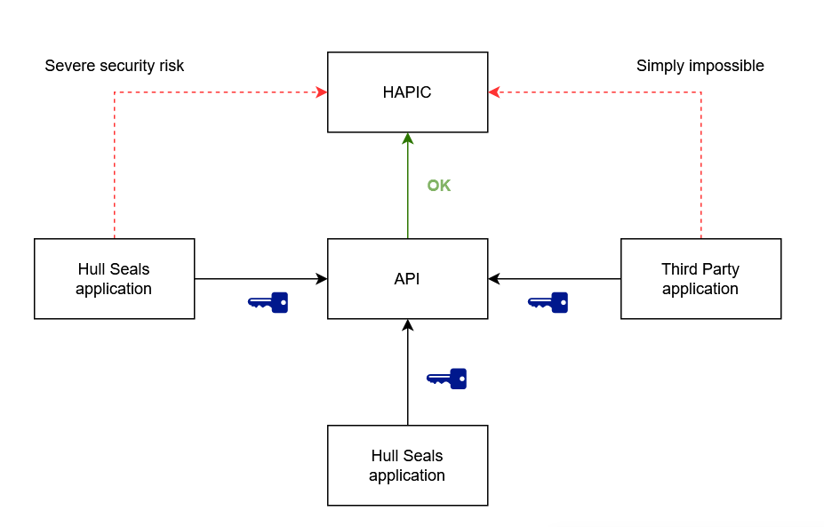

# HalpyBOT API connector (HAPIC)

HalpyBOT uses a small and simple Aiohttp server to receive
simple requests from the API. 

```
# Note

API Connector does not, and will not, support the Dispatch Board.
For this purpose, a websocket connection will be used. (probably)
```

## Purpose

API Connector implements simple webhooks that the API may use to directly
interact with HalpyBOT, UnrealIRCd, and Anope as an IRC Operator.

## Security

Direct access to the bot, IRC daemon, and services is a security-critical privilege
and great care must be taken to avoid abuse at all costs. To ensure this, the following
principles must be followed when developing with HAPIC:

- Preferabbly, ALL interactions with HAPIC should be routed via the Hull Seals API.

- HAPIC only has one permission level: Do Everything™. Therefore, the system
will assume that ALL incoming requests from a registered and logged in source are valid, verified, authenticated, and legitimate.
  This means that only one step of authentication takes place: applications that implement HAPIC
  authenticate on startup and from then on have full access.
  
**What this means**:

Authentications for ALL requests that are (partially) executed as HalpyBOT MUST happen in the calling application:


