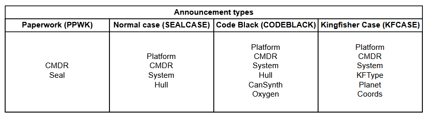

# HAPIC Announcer

Case announcements are handled through Hull Seals API and
HAPIC.

# Routes

***

## POST `/announce`

### Description:

Announce a message. Be aware that this does not automatically create a new case, anywhere.
Announcement settings can be edited in `data/announcer/announcer.json`.

If a "System" parameter is specified, and EDSM queries for the used announcements are
enabled, HalpyBOT will run an EDSM query on the "System" parameter and send its results to the specified
channels.

### Usage:

```json
{
    "type": "Case Type",
    "parameters": {
      "Platform": "Platform Identifying Integer",
      "CMDR": "Client name",
      "Seal": "Seal name",
      "System": "System name. EDSM query will be ran with this parameter if enabled.",
      "Hull": "Hull percentage",
      "CanSynth": "Yes or No",
      "Oxygen": "Oxygen timer",
      "KFType": "Kingfisher case type",
      "Planet": "Planet name",
      "Coords": "Coordinates on a planet"
    }
}
```

ONLY include the parameters required for the specific type of announcement:



### Example:

```json
{
    "type": "KFCASE",
    "parameters": {
        "Platform": "1",
        "CMDR": "Rik079",
        "System": "Sol",
        "Planet": "Mercury",
        "Coords": "1 2 3",
        "KFType": "Puck"
    }
}
```

Outputs:

```
[12:00:00] [%HalpyBOT]: xxxx PCKFCASE -- NEWCASE xxxx
[12:00:00] [%HalpyBOT]: CMDR: Rik079 -- Platform: PC
[12:00:00] [%HalpyBOT]: System: Sol -- Planet: Mercury
[12:00:00] [%HalpyBOT]: Coordinates: 1 2 3
[12:00:00] [%HalpyBOT]: Type: Puck
[12:00:00] [%HalpyBOT]: xxxxxxxx
[12:00:00] [%HalpyBOT]: System exists in EDSM. The closest landmark system is Sol at 0.0 LY.
```

***